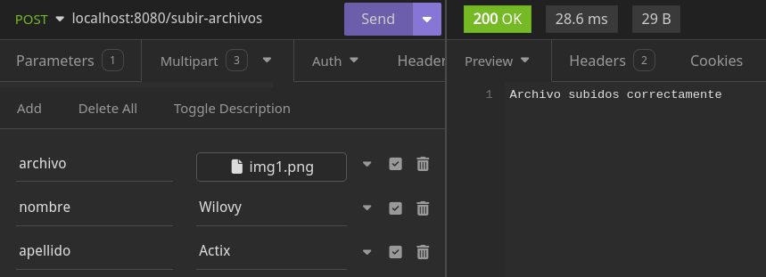

# Notas Actix

## Como leer variables de un `.env`

Instalamos un paquete `dotenv`

```sh
cargo add dotenv
```

Creamos un archivo `.env` y definimos algunas variables en el

```env
URL=https://www.wilovy.com
NOMBRE=Wilovy
```

Ahora en nuestro `main.rs` pondremos lo siguiente:

```rust
use dotenv::dotenv; // esto es el paquete que instalamos
use std::env;

fn main() {
    dotenv().ok();

    let nombre = env::var("NOMBRE").expect("Falta NOMBRE");
    let url = env::var("URL").expect("Falta URL");

    println!("Nombre: {}, URL: {}", nombre, url)
}
```

## Estructura básica para iniciar una API

```sh
cargo install cargo-watch
```

```rust
use actix_web::{get, http::header, App, HttpResponse, HttpServer};

#[get("/")]
async fn test() -> HttpResponse {
    HttpResponse::Ok()
        .content_type(header::ContentType::json())
        .body(
            r#"
    {
        "ok": "ok"
    }
    "#,
        )
}

#[actix_web::main]
async fn main() -> std::io::Result<()> {
    HttpServer::new(|| App::new().service(test))
        .bind(("127.0.1", 8080))?
        .run()
        .await
}
```

```sh
cargo watch -x run
```

## Parametros con struct

```rust
use actix_web::{get, http::header, web, HttpResponse};
use serde::Deserialize;

#[derive(Deserialize)]
struct Parametros {
    id: u8,
    estado: String,
}

// Esto es con Path Params
#[get("/usuarios/{id}/{estado}")]
async fn usuario(parametros: web::Path<Parametros>) -> HttpResponse {
    HttpsResponse::Ok()
        .content_type(header::ContentType::json())
        .body(format!(r#"
        {{
            "id": {},
            "estado": "{}"
        }}
        "#, parametros.id, parametros.estado))
}

// Esto es con Query Params
#[get("/usuario")]
async fn usuario(parametros: web::Query<Parametros>) -> HttpResponse {
    HttpResponse::Ok()
        .content_type(header::ContentType::json())
        .body(format!(
            r#"{{
            "id": {},
            "estado": "{}"
        }}"#,
            parametros.id, parametros.estado
        ))
}
```

## Procesar JSONS

Para recibir jsons en post o asi

```rust
use actix_web::{post, web, HttpResponse};
use serde::Deserialize;

#[derive(Deserialize)]
struct SumaParams {
    a: u8,
    b: u8,
    c: u8,
}

#[post("/suma")]
// Actix se encarga de validar el tipo segun la struct (web::Json<STRUCT_NAME>)
async fn suma(parametros: web::Json<SumaParams>) -> HttpResponse {
    let resultado = parametros.a + parametros.b + parametros.c;
    HttpResponse::Ok().body(format!("Resultado es: {}", resultado))
}
```

## URL Encoded forms

```rust
use actix_web::{post, web, HttpResponse};
use serde::Deserialize;

#[derive(Deserialize)]
struct Persona {
    nombre: String,
    apellido: String,
    edad: u8,
}

#[post("/persona")]
async fn persona(parametros: web::Form<Persona>) -> HttpResponse {
    HttpResponse::Ok().body(format!(
        "Tu nombre es: {} {}, tu edad es: {}",
        parametros.nombre, parametros.apellido, parametros.edad
    ))
}
```

## Responder con JSONs

```rust
use actix_web::{get, web, Responder};
use serde::Serialize;

// Se pueden incluir ambas, Serialize y Deserialize en una misma struct
#[derive(Serialize)]
struct Autor {
    id: u8,
    nombre: String,
    apellido: String,
}

#[get("/autor")]
async fn autor() -> impl Responder {
    let autor: Autor = Autor {
        id: 1,
        nombre: "Wilovy".to_string(),
        apellido: "Rust".to_string(),
    };

    web::Json(autor)
}
```

Pero si queremos cambiar el `status code`, tenemos que retornar un `HttpResponse`

```rust
use actix_web::{get, web, HttpResponse};
use serde::Serialize;

#[derive(Serialize)]
struct Autor {
    id: u8,
    nombre: String,
    apellido: String,
}

#[get("/autor")]
async fn autor() -> HttpResponse {
    let autor: Autor = Autor {
        id: 1,
        nombre: "Wilovy".to_string(),
        apellido: "Rust".to_string(),
    };

    // Para mantenerlo sencillo usaremos Created (201)
    HttpResponse::Created().json(autor)
}
```

Pero..., los JSONs que estamos regresando son muy sencillos, mejor intentemos hacer que regrese el autor con un listado de libros.

```rust
use actix_web::{get, web, HttpResponse};
use serde::Serialize;


#[derive(Serialize)]
struct Libros {
    id: u8,
    titulo: String
}

#[derive(Serialize)]
struct Autor {
    id: u8,
    nombre: String,
    apellido: String,
    libros: Vec<Libros>
}

#[get("/autor")]
async fn autor() -> HttpResponse {
    let autor: Autor = Autor {
        id: 1,
        nombre: "Wilovy".to_string(),
        apellido: "Rust".to_string(),
        libros: vec![
            Libros {
                id: 1,
                titulo: "Rust desde 0".to_string(),
            },
            Libros {
                id: 1,
                titulo: "Actix desde 0".to_string(),
            },
        ],
    };

    // Para mantenerlo sencillo usaremos Created
    HttpResponse::Created().json(autor)
}
```

## Subir archivos

### Un solo archivo

Para lograr esto tenemos que agregar a nuestro formulario de html el atributo `enctype='multipart/form-data'` e instalar unas dependencias a nuestro proyecto

```html
<form action="subir-archivo" method="post" enctype="multipart/form-data"></form>
```

```sh
cargo add actix-multipart
cargo add futures-util
```

Ahora si nuestro código

```rust
use actix_multipart::Multipart;
use actix_web::{post, web, Error, HttpResponse};
use futures_util::TryStreamExt;
use std::io::Write;

#[post("/subir-archivo")]
async fn subir_archivo(mut payload: Multipart) -> Result<HttpResponse, Error> {
    while let Some(mut field) = payload.try_next().await? {
        // Verificamos si content_disposition tiene un valor válido
        let Some(content_disposition) = field.content_disposition() else { continue; };

        let file_name = content_disposition
            .get_filename()
            .expect("Falta nombre al archivo.");
        /* Esta es la ruta donde se guardara el archivo que nos manden en el API
         * Esto significa que buscara una carpeta `assets` en la raiz de nuestro proyecto
         * A la misma altura que src, target, Cargo.toml
        */
        let file_path = format!("./assets/{file_name}");

        let mut archivo = web::block(|| std::fs::File::create(file_path)).await??;

        while let Some(chunk) = field.try_next().await? {
            archivo = web::block(move || archivo.write_all(&chunk).map(|_| archivo)).await??;
        }
    }
    Ok(HttpResponse::Ok().body("Archivo subido correctamente"))
}
```

Para probar nuestra API en un HttpClient (Insomnia) tenemos que irnos a `Body`>`Multipart form`> y en value seleccionar `file`

Un error que tiene esto, es que si se vuelve a enviar un archivo con el mismo nombre, se sobreescribe el archivo anterior.

### Subir mayor información, no solo un archivo

```rust
use actix_multipart::form::{tempfile::TempFile, text::Text, MultipartForm};
use actix_web::{post, web, Error, HttpResponse};

pub fn config(cfg: &mut web::ServiceConfig) {
    cfg.service(subir_archivos);
}

#[derive(Debug, MultipartForm)]
pub struct FormularioConArchivos {
    pub nombre: Text<String>,
    pub apellido: Text<String>,
    pub archivo: TempFile,
    // pub archivo2: TempFile,
}

#[post("/subir-archivos")]
async fn subir_archivos(
    MultipartForm(form): MultipartForm<FormularioConArchivos>,
) -> Result<HttpResponse, Error> {
    println!(
        "Nombre: {}, Apellido: {}",
        form.nombre.as_str(),
        form.apellido.as_str()
    );

    // Si fuera una lista de archivos seria hacer un loop
    let file_name = form.archivo.file_name.unwrap();
    let file_path = format!("./assets/{file_name}");
    form.archivo.file.persist(file_path).unwrap();

    Ok(HttpResponse::Ok().body("Archivo subidos correctamente"))
}
```

Y en nuestro HttpClient hariamos algo asi:



El "problema" que tiene esto es que `MultipartForm` tiene un limite de subida, por defecto son `50mb` en total, si se manda más de `50mb` totales te dara un error donde se dice que se excedio el limite de memoria (error 400).

### Aumentar el espacio en memoria

```rust
// Importamos `MultipartFormConfig` de form
use actix_multipart::form::MultipartFormConfig;
use actix_web::{App, HttpServer};
mod routes;

#[actix_web::main]
async fn main() -> std::io::Result<()> {
    HttpServer::new(|| {
        // Definos una constante para definir nuestros mb
        const MB: usize = 1024 /* 1024 es un kb */ * 1024 /* 1kb x 1024 = 1mb */ * 100 /* 1mb x 100 = 100mb */;
        // Definimos una variable para nuestra config
        let multipartform_config = MultipartFormConfig::default()
            // El tamaño de estos metodos es en `bytes`
            .total_limit(MB)
            .memory_limit(MB);
        App::new()
            .app_data(multipartform_config)
            //...code...
    })
    .bind(("127.0.0.1", 8080))?
    .run()
    .await
}
```

## Archivos estáticos y descargar archivos

Pra poder trabajar con archivos estaticos tenemos que instalar un paquete.

```sh
cargo add actix-files
```

Vamos a crear una carpeta en la raiz de nuestro proyecto `static/`

```txt
📁.
├──📄Cargo.lock
├──📄Cargo.toml
├──📄README.md
├──📁static
│  ├──📁css
│  ├──📁img
│  └──📁js
├──📁static
└──📁target
```

Con esto podriamos visualizar nuestros archivos estaticos.

```rust
use actix_files::NamedFile;
use actix_web::{get, Error, HttpRequest, Result};
use std::path::PathBuf;


#[get("/static/{filename:.*}")]
async fn archivos_estaticos(req: HttpRequest) -> Result<NamedFile, Error> {
    let pbuf: PathBuf = req.match_info().query("filename").parse().unwrap();
    let mut ruta = pbuf.into_os_string().into_string().unwrap();

    ruta = format!("./static/{ruta}");

    let archivo = NamedFile::open(ruta)?;

    Ok(archivo.use_last_modified(true))
}
```

Pero si queremos poder descargarlos debemos hacer una pequeña modificación:

```rust
use actix_files::NamedFile;
use actix_web::{get, http::header::ContentDisposition, Error, HttpRequest, Result};
use std::path::PathBuf;

#[get("/static/{filename:.*}")]
async fn archivos_estaticos(req: HttpRequest) -> Result<NamedFile, Error> {
    let pbuf: PathBuf = req.match_info().query("filename").parse().unwrap();
    let ruta = format!("./static/{}", pbuf.into_os_string().into_string().unwrap());

    let archivo = NamedFile::open(ruta.clone())?;

    Ok(archivo.set_content_disposition(ContentDisposition::attachment(ruta.clone().as_str())))
}
```

## Bases de datos - SQLx

Para entender como funciona esto, haremos una mini API que nos permitira entender como funciona `actix-web` con `sqlx`, para trbajar con SQLx debemos de instalar manualmente en nuestro `Cargo.toml` lo siguiente:

```toml
[dependencies]
sqlx = { version = "0.8.1", features = [ "runtime-async-std", "sqlite", "macros", "migrate" ] }
```

Ahora si podemos añadir las demas dependencias de forma normal

```sh
cargo add actix-web dotenv
```

```sh
cargo add serde -F derive
```

Adicionalmente podemos instalar el [CLI](https://github.com/launchbadge/sqlx/blob/main/sqlx-cli/README.md) que nos da sqlx:

```sh
cargo install sqlx-cli --no-default-features --features sqlite
```

Este [CLI](https://github.com/launchbadge/sqlx/blob/main/sqlx-cli/README.md) nos da facilidades al momento de crear migraciones con comandos como:

```sh
sqlx database create
sqlx database drop
sqlx migrate add NOMBRE_MIGRACIÓN
sqlx migrate run
```

Ahora debemos de crear un `.env` en el que definiremos nuestra variable de entorno.

```env
DATABASE_URL=sqlite://$PWD/temp/sqlx.db
```

Corremos el comando del CLI

```sh
sqlx database create
```

```rust
// src/main.rs
use actix_web::{web::Data, App, HttpServer};
use dotenv::dotenv;
use sqlx::{sqlite::SqlitePoolOptions, Pool, Sqlite};
mod services;
use services::{create_user_article, fetch_user_articles, fetch_users};

pub struct AppState {
    db: Pool<Sqlite>,
}

#[actix_web::main]
async fn main() -> std::io::Result<()> {
    dotenv().ok();

    let database_url = std::env::var("DATABASE_URL").expect("No se encontro DATABASE_URL");
    let pool = SqlitePoolOptions::new()
        .max_connections(5)
        .connect(&database_url)
        .await
        .expect("Error al crear la conexión a la base de dato");

    HttpServer::new(move || {
        App::new()
            .app_data(Data::new(AppState { db: pool.clone() }))
            .service(fetch_users)
            .service(fetch_user_articles)
            .service(create_user_article)
    })
    .bind(("127.0.0.1", 8080))?
    .run()
    .await
}
```

Creamos un archivo `services.rs` a la mista altura que `main.rs`

```rs
// src/services.rs
use crate::AppState;
use actix_web::{
    get, post,
    web::{Data, Json, Path},
    HttpResponse, Responder,
};
use serde::{Deserialize, Serialize};
use sqlx::{self, FromRow};

#[derive(Serialize, FromRow)]
struct User {
    id: i32,
    name: String,
    last_name: String,
}

#[derive(Serialize, FromRow)]
struct Article {
    id: i32,
    title: String,
    content: String,
    created_by: i32,
}

#[derive(Deserialize)]
pub struct CreateArticleBody {
    pub title: String,
    pub content: String,
}

#[get("/users")]
async fn fetch_users(state: Data<AppState>) -> impl Responder {
    match sqlx::query_as::<_, User>("SELECT id, name, last_name FROM users")
        .fetch_all(&state.db)
        .await
    {
        Ok(users) => HttpResponse::Ok().json(users),
        Err(_) => HttpResponse::NotFound().json("No users found"),
    }
}

#[get("/users/{id}/articles")]
async fn fetch_user_articles(path: Path<i32>, state: Data<AppState>) -> impl Responder {
    let id: i32 = path.into_inner();

    match sqlx::query_as::<_, Article>(
        "SELECT id, title, content, created_by WHERE created_by = $1",
    )
    .bind(id)
    .fetch_all(&state.db)
    .await
    {
        Ok(articles) => HttpResponse::Ok().json(articles),
        Err(_) => HttpResponse::NotFound().json("No articles found"),
    }
}

#[post("/users/{id}/articles")]
async fn create_user_article(
    path: Path<i32>,
    body: Json<CreateArticleBody>,
    state: Data<AppState>,
) -> impl Responder {
    let id: i32 = path.into_inner();

    match sqlx::query_as::<_, Article>("INSERT INTO articles (title, content, created_by) VALUES ($1, $2, $3) RETURNING id, title, content, created_by")
        .bind(body.title.to_string())
        .bind(body.content.to_string())
        .bind(id)
        .fetch_one(&state.db)
        .await
    {
        Ok(article) => HttpResponse::Ok().json(article),
        Err(_) => HttpResponse::InternalServerError().json("Failed to create user article")
    }
}
```

<!-- WIP -->

## Seguridad en API (WIP)
